# Call14 — Smart Elevator Companion

> A DIY apartment elevator call and tracking system built with ESP8266,
> Home Assistant, MQTT, and computer vision — without modifying the elevator
> controller.

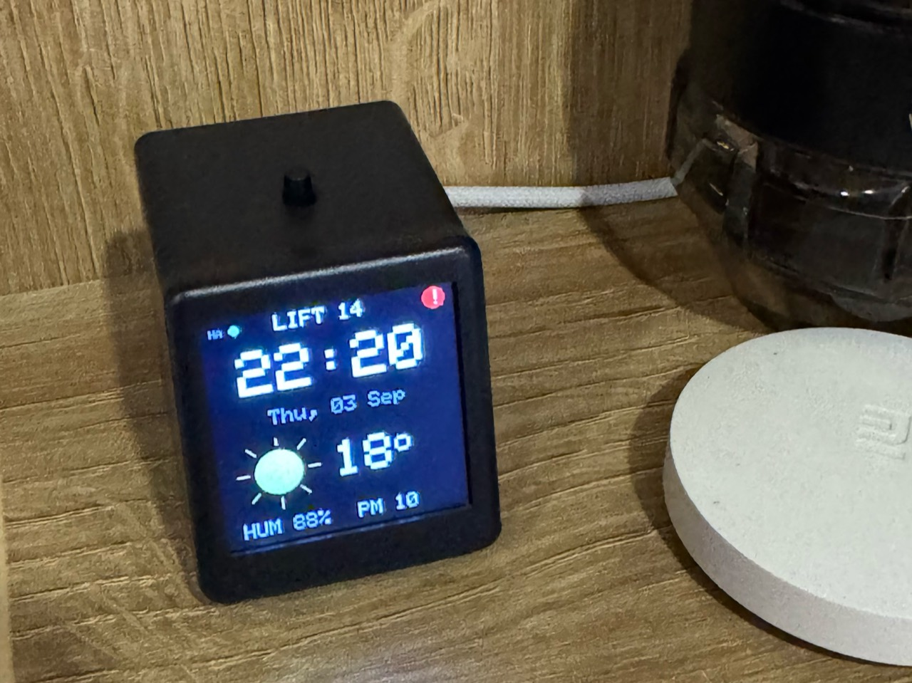

Call14 began with a small question: why wait in the hallway for the elevator
when it could be called while you are still getting ready to leave?

I live with my family on the 14th floor in Kyiv. Waiting several minutes for an
elevator is normally just an inconvenience. During air-raid alerts, however,
getting the children ready and reaching shelter quickly can make those minutes
feel much more important.

I am an entrepreneur, not a professional programmer or electronics engineer.
This is a hobby project, and it was my first time building a system like this.
I learned each layer — UART flashing, ESP8266 firmware, Home Assistant, MQTT,
and computer vision — when the project required it.

What began as a round Xiaomi smart button named **“Lift Button”** at home grew
into a complete system:

- an ESP8266 relay electrically reproduces pressing the existing hall-call
  button;
- a local computer-vision service reads the floor indicator visible through an
  authorized cabin camera;
- Home Assistant connects the call control, elevator telemetry, weather,
  air-raid alerts, and backup-power data;
- a modified inexpensive ESP8266 clock near the apartment door provides a
  physical call button and an always-on status display.

I did not want this convenience to belong to one apartment only, so every
neighbour on our floor can also call the elevator through **DomoBot**, the
Telegram bot we built for our building. DomoBot deserves a separate story of
its own; here it is simply another interface to the same Home Assistant call
script.

## See it work

[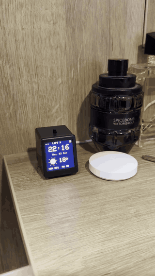](media/video/call14-clock-demo.mp4)

Press the button, watch the interface switch from the home screen to `CALLING`,
follow the recognized floor and direction, and see it settle on `IDLE` at floor
14. The animation is a 3×-speed silent preview; click it for the full real-time
MP4. Recognition and display updates remain on the local network.

## What it cost

The surprising part is that hardware was not the expensive part. My total new
spend was **no more than about USD 20**; most of the real cost was thought,
experimentation, repeated soldering, and roughly six months of spare-time
iteration.

| Part | What I used | Approximate cost |
|---|---|---:|
| Hall-call relay and cable | XY-WF36V/ESP8285 relay plus roughly 10 m of low-voltage cable | under $10 total |
| Indoor button | An existing Xiaomi smart button | $0 for me |
| Optional new button | Any compatible battery Wi-Fi/Zigbee button | about $10 |
| Call14 clock | JUZIPi SD_PRO-style ESP8266 clock | 224–230 UAH, about $5–6 |
| Added tactile switch | A spare normally-open switch | a few cents |
| Home Assistant server | An old Mac already running at home | $0 incremental |
| Recognizer camera | Existing authorized cabin-security camera | $0 incremental |
| Software | ESPHome, Home Assistant, MQTT and the local recognizer | $0 |

A phone or Home Assistant dashboard can call the elevator without buying the
indoor button. Likewise, an old computer or laptop is sufficient for the local
services; a new server is not a project requirement.

Example listings used or considered during the build:

- [Wi-Fi relay similar to the installed module](https://a.aliexpress.com/_EJFKJUO)
- [Battery smart button that does not require a separate hub](https://a.aliexpress.com/_EyHNxK2)
- [ESP8266 clock used as the display enclosure and hardware base](https://a.aliexpress.com/_EJPZNDC)

Listings and prices change. Select hardware by electrical requirements and
verified pinout, not by enclosure appearance alone.

## Choose how far you want to take it

Call14 can be reproduced in independent stages:

1. **Remote call only.** Use a compatible Wi-Fi relay's original application
   and call from a phone. No Home Assistant, display or camera is required.
2. **Local smart-home call.** Flash the relay with the provided
   [ESPHome configuration](firmware/relay/), then call it from Home Assistant,
   a phone or a wireless button.
3. **Floor tracking.** Add an authorized camera and adapt the
   [hybrid v5 recognizer](recognizer/). The included
   [Codex setup prompt](recognizer/CODEX_SETUP_PROMPT.md) guides calibration for
   another indicator instead of reusing camera-specific coordinates blindly.
4. **Complete Call14 terminal.** Modify the supported clock, flash the
   [display firmware](firmware/display/), and connect the
   [Home Assistant MQTT bridge](home-assistant/).

Each stage remains useful on its own. Start with the smallest version that fits
your building rules, authorization, hardware and experience.

## How the complete system works

Call14 has two deliberately separate paths. The **control path** can only
reproduce a hall-button press. The **observation path** can only watch the
existing indicator. They meet in Home Assistant, but neither depends on direct
access to the elevator controller.

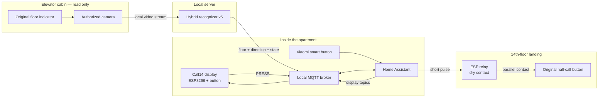
```mermaid
flowchart LR
    subgraph Home[Inside the apartment]
        Clock[Call14 display\nESP8266 + button]
        Xiaomi[Xiaomi smart button]
        HA[Home Assistant]
        MQTT[Local MQTT broker]
    end

    subgraph Landing[14th-floor landing]
        Relay[ESP relay\ndry contact]
        Hall[Original hall-call button]
    end

    subgraph Cabin[Elevator cabin — read only]
        Indicator[Original floor indicator]
        Camera[Authorized camera]
    end

    subgraph Server[Local server]
        V5[Hybrid recognizer v5]
    end

    Clock -->|PRESS| MQTT
    Xiaomi --> HA
    MQTT <--> HA
    HA -->|short pulse| Relay
    Relay -. parallel contact .-> Hall

    Indicator --> Camera
    Camera -->|local video stream| V5
    V5 -->|floor + direction + state| MQTT
    HA -->|display topics| MQTT
    MQTT --> Clock
```

### What happens after one press

1. I press the small button on top of the Call14 display while getting ready to
   leave.
2. The ESP8266 publishes a local `PRESS` event over MQTT and immediately opens
   the elevator screen, so the interaction feels instant.
3. Home Assistant runs the same call script used by the Xiaomi button and phone
   dashboard.
4. The landing relay closes its isolated contact for a short pulse. Electrically,
   the elevator sees the same event as a finger pressing the original button.
5. The camera recognizer independently observes the cabin indicator and sends
   the confirmed floor and direction back through MQTT.
6. The display follows the elevator until it arrives. By the time I lock the
   apartment and reach the landing, the doors can already be opening — the small
   everyday moment that made the whole project feel worthwhile.

The normal hall-call button continues to work even if Wi-Fi, Home Assistant,
the camera, or the display is offline. Recognition is also not part of the call
circuit: losing the video feed only removes telemetry.

### The Home Assistant view

The dashboard combines the live cabin view with a custom elevator card. Its
seven-segment styling mirrors the physical indicator and shows the confirmed
floor, direction and motion state. The button at the bottom calls the elevator
to the 14th floor through the same script used by the physical interfaces.

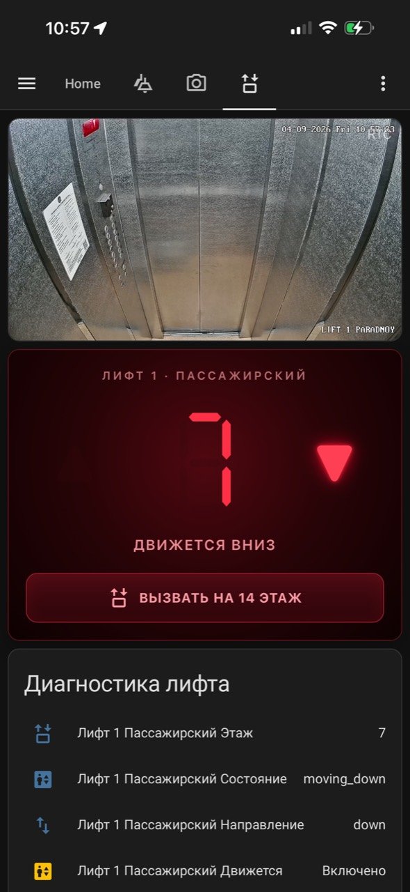

MQTT Discovery creates a dedicated elevator device instead of a loose collection
of values. Alongside the main floor and direction it exposes camera availability,
recognizer confidence, last-frame time, fault state and whether a value is
camera-confirmed or estimated. In production v5, dead-reckoned floor prediction
is disabled; the screenshot therefore reports `camera` as the source and 100%
confidence for this observation.

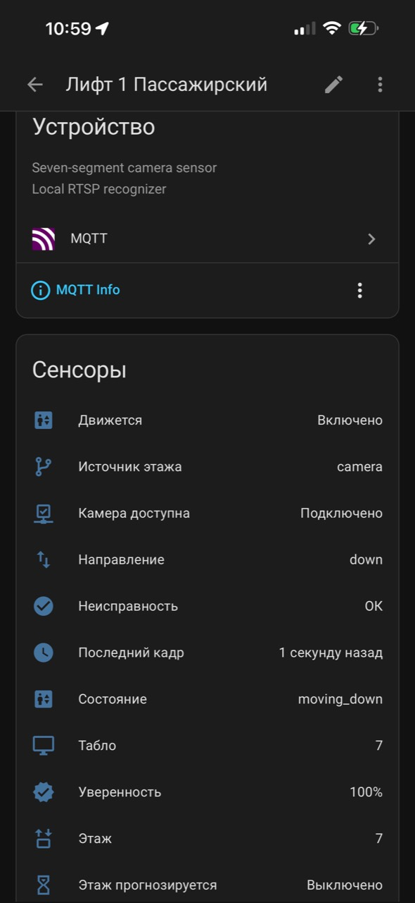

## Part 1: calling the elevator from home

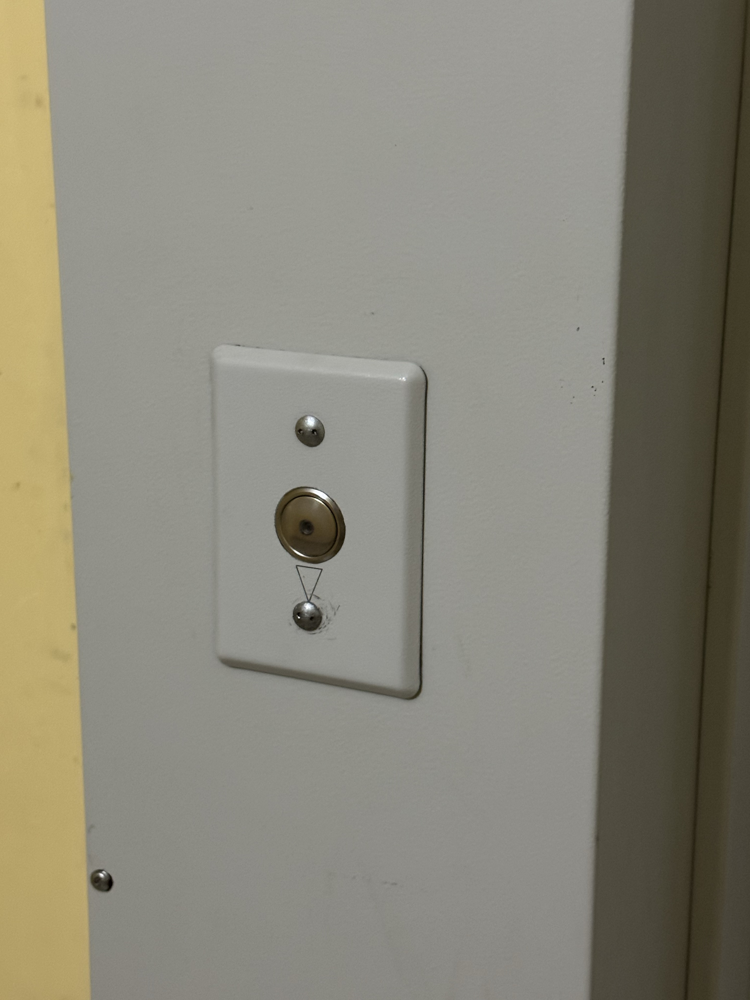

The first version solved only one problem: calling the elevator without first
walking into the hallway. A round Xiaomi smart button that I already used with
my smart home became the interface. In Home Assistant — and soon in our family
vocabulary — it was simply called **Lift Button**.

Later, the call action was made available through DomoBot to every resident on
our floor. The hardware remained exactly the same: the bot only asks Home
Assistant to run the same short, local call-button pulse. The story of the
building-wide Telegram bot will be a separate project.

Behind the existing hall-call button, I identified the two contacts closed by a
normal press and connected an isolated relay contact in parallel. The original
button continues to work normally; Call14 merely reproduces the same momentary
contact closure.

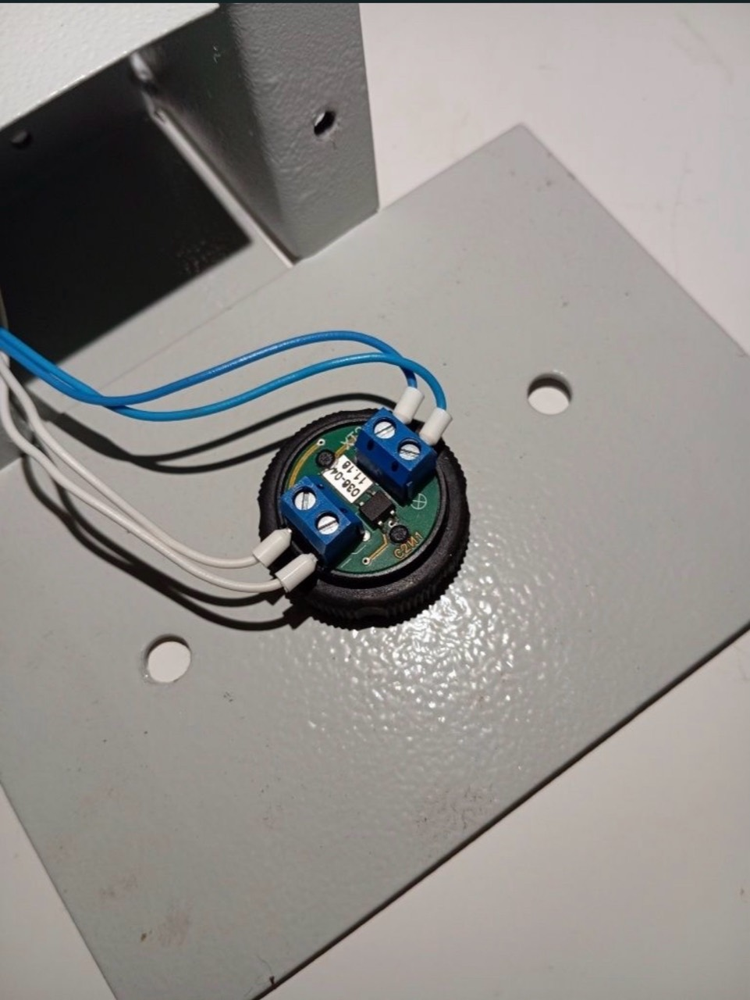

### The first hardware assumption that failed

I chose an inexpensive `XY-WF36V` Wi-Fi relay module because it accepts a wide
DC supply range. Many elevator call-button circuits use approximately 12–24 V
DC, so I hoped the same local supply could power the module while its dry relay
contact reproduced the button press.

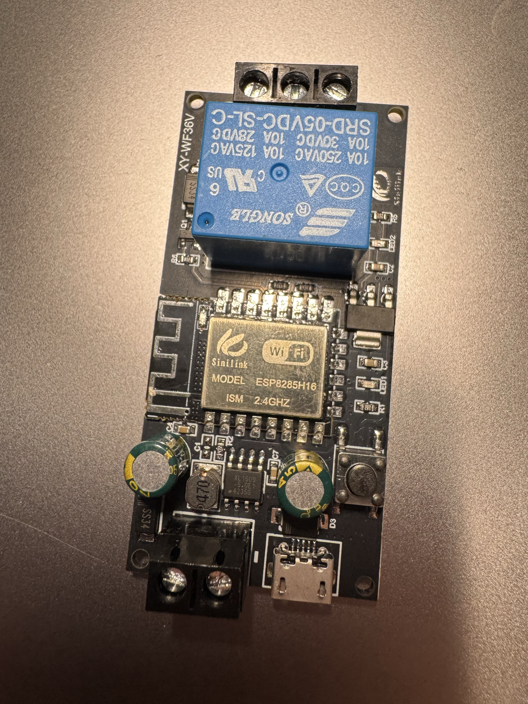

My elevator had a surprise waiting: the available button voltage was about
24 V **AC**, not DC. The selected module could not be powered from it directly.
I ultimately ran roughly 10 metres of low-voltage cable from an existing access
control power supply on the floor.

This became the first reusable lesson of the project: measure the available
voltage and confirm both its level and whether it is AC or DC before selecting
the relay and power architecture.

### Replacing the vendor firmware

The module already had its own mobile application, and someone interested only
in remote calling could keep that simpler setup. My goal was deeper integration
with Home Assistant and local automations, so I connected to the module's UART
pads and replaced the original firmware.

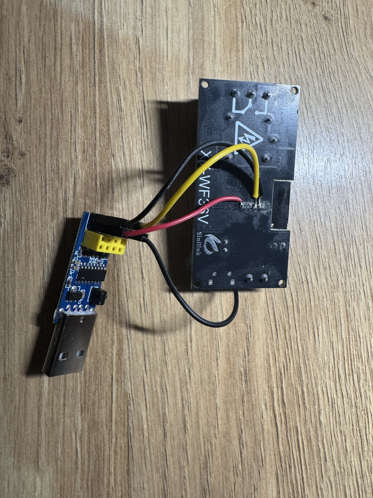

To enter the ESP8266 serial bootloader, `GPIO0` must be held to ground during
reset or power-up. After the initial wired flash, OTA updates allowed later
changes over Wi-Fi.

The complete verified pin tables and connection notes are in
[`docs/WIRING.md`](docs/WIRING.md).

The public release will include a generic configuration with credentials,
addresses, and installation-specific values removed.

### Several ways to build only this part

The full Call14 system uses Home Assistant, but the basic remote-call function
does not require the display or computer vision. It could be implemented with:

- the relay manufacturer's original application;
- a phone control exposed by a smart-home platform;
- an inexpensive Zigbee/Wi-Fi button similar to the original Xiaomi button;
- Home Assistant and a local automation, as used in this project.

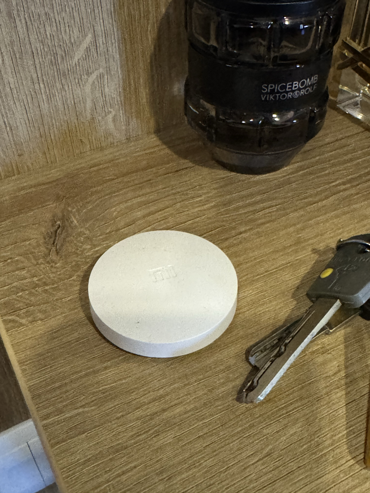

Automatic calling based on air-raid alerts was also considered. Because alerts
are frequent and an automatic call could summon the elevator when nobody is
actually leaving, the production system deliberately keeps elevator calling a
manual action.

## Part 2: turning a $5 clock into Call14

Once Home Assistant knew the elevator's floor and direction, a new usability
problem appeared: checking a phone every time before leaving was too slow and
too distracting. The information needed a permanent place near the front door.

I found a tiny JUZIPi SD_PRO-style weather clock on AliExpress and paid
224.26 UAH including delivery during a promotion — approximately USD 5 at the
time.

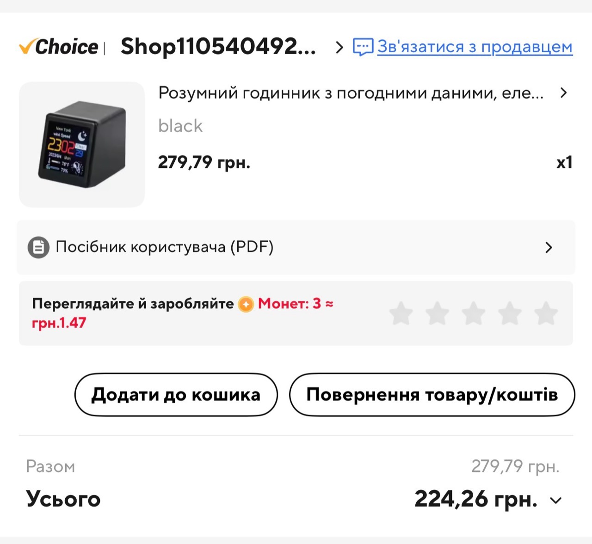

The enclosure contained an ESP8266 ESP-12F module and a 240×240 color display.
That made it powerful enough for Wi-Fi, MQTT, a lightweight custom interface,
and OTA updates, but limited enough that memory use and screen redraws had to be
treated carefully.

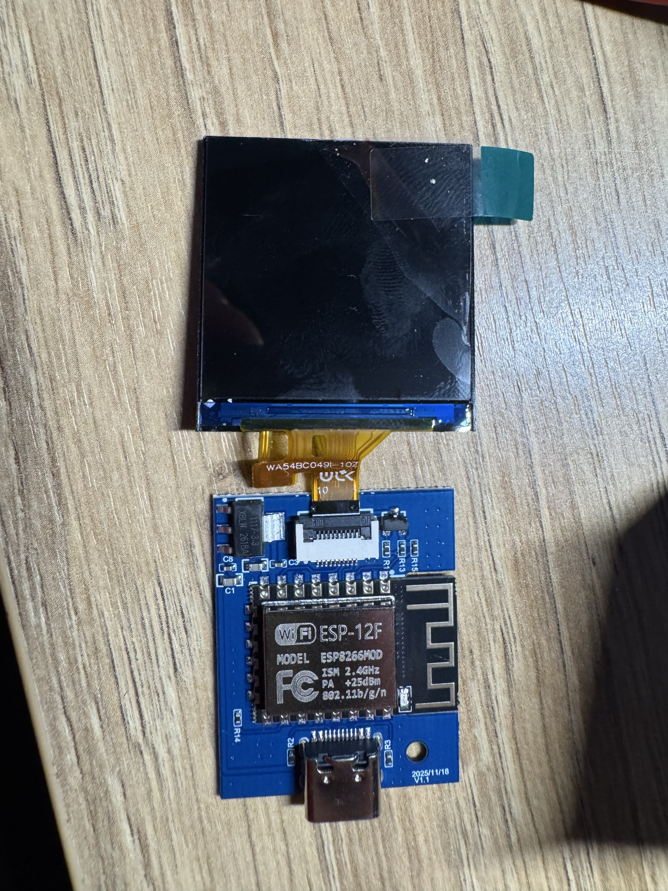

### A custom firmware, with a recovery path

The original clock already supported browser firmware updates, which provided
a convenient route for the first custom build. Losing that update path would
mean reopening the case and flashing over UART, so recoverability became a
first-class requirement rather than an afterthought.

That caution turned out to be justified. During development I repeatedly had
to open the enclosure, solder to the board, connect my ESP programmer, enter a
special recovery/boot mode, and restore a working firmware before continuing.

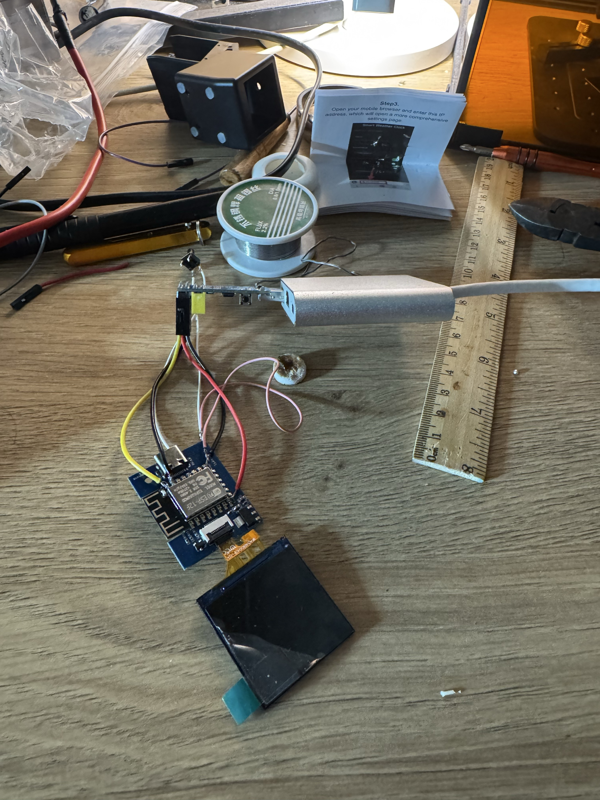

The finished firmware keeps both web-based firmware upload and Arduino OTA,
along with a fallback recovery access point. It also includes a display-safe
startup mode: holding the added button during power-up leaves the display
disabled while networking and the update interface remain available.

Some newer factory releases already expose browser OTA, which can make the first
custom flash deceptively easy. **Verify the display controller and pin mapping
before using it.** An OTA upload may succeed even when the new firmware cannot
drive the screen. That exact mistake left this clock with a black display and
forced another teardown, direct ESP8266 UART soldering, and bootloader recovery.

### Adding the missing physical control

The rear of the clock PCB exposes three pads marked `G V O`. A continuity test
confirmed that `O` connects to **GPIO4**, a suitable input that is not one of
the ESP8266's boot-strap pins. The firmware configures it with the internal
pull-up resistor, and a normally-open button shorts `O` to `G` when pressed.

I used a small tactile switch that was already in my electronics parts box,
drilled one hole in the top of the enclosure, and fixed the switch in place.

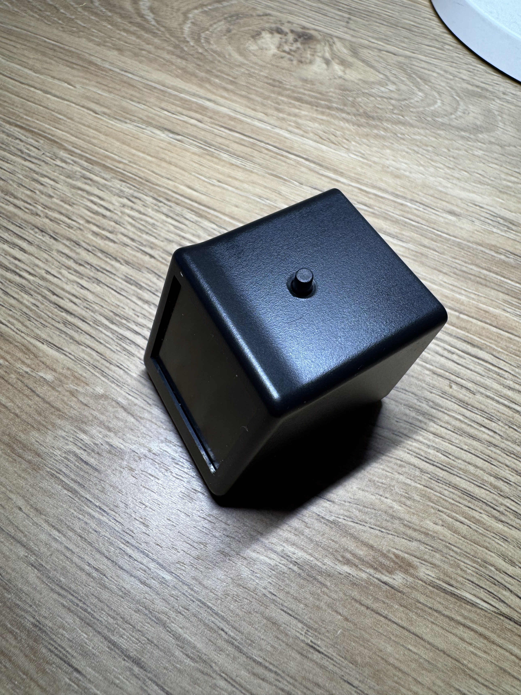

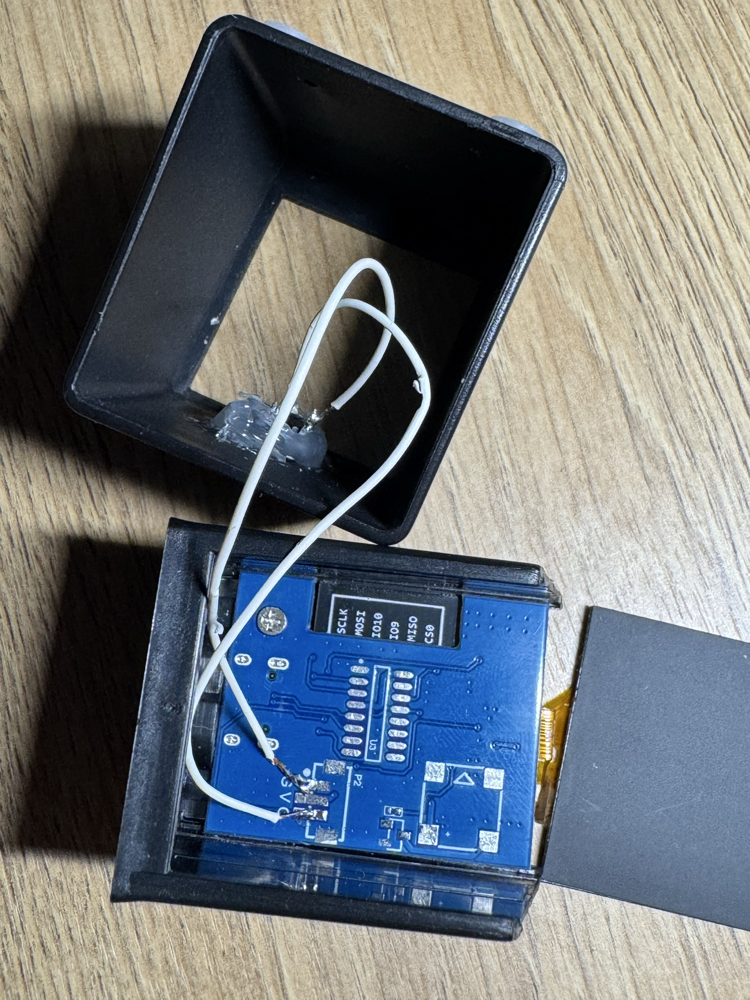

A capacitive touch sensor could be used in a future build to avoid drilling the
case. I kept the mechanical button because it provides clear tactile feedback
and can be pressed without looking at the device.

The button is context-aware: a normal press calls the elevator when the regular
home screen is visible; while the elevator view is already open, it changes the
display page instead. A long press cycles screen brightness.

### From generic clock to home status terminal

The clock still shows time, date, weather, humidity, and air quality, but its
top line now continuously reports the elevator floor. When a call is made, the
interface switches to a dedicated elevator view with a large floor number,
direction, and state.

The same display can surface air-raid status and practical household power
information from Home Assistant, including grid availability, inverter state,
and battery charge. The project had stopped being only an elevator button; it
had become a small always-on home terminal.

| Daily home view | Dedicated elevator view |
|---|---|
| 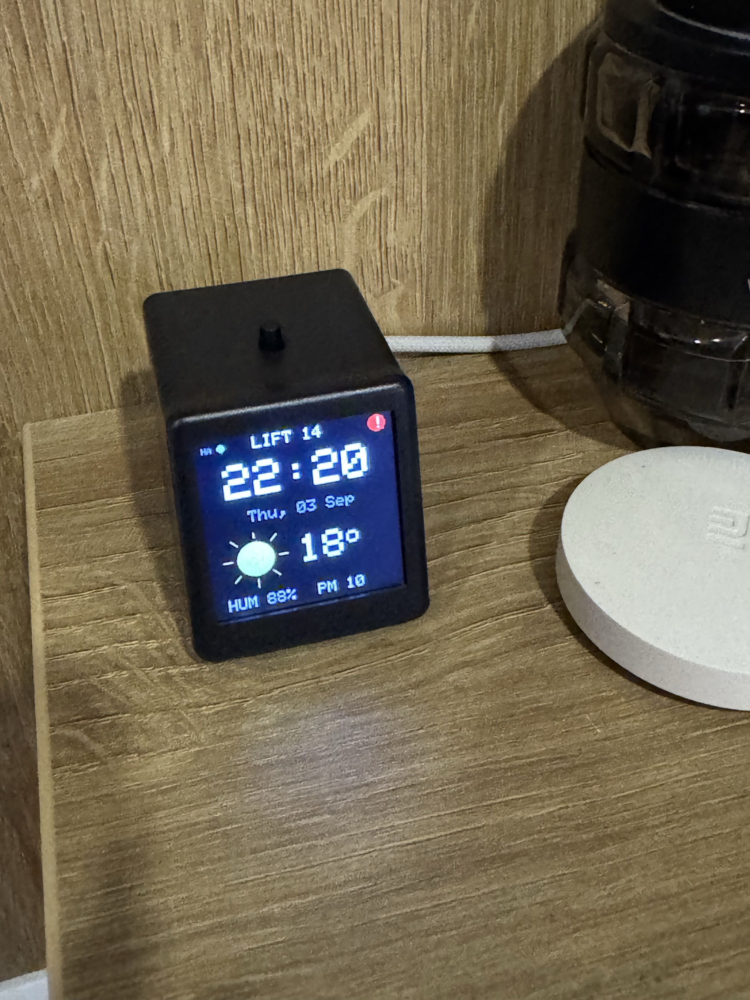 | 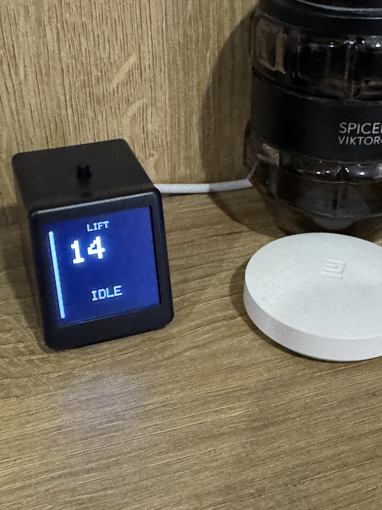 |

| Power outage view | Energy-flow view |
|---|---|
| 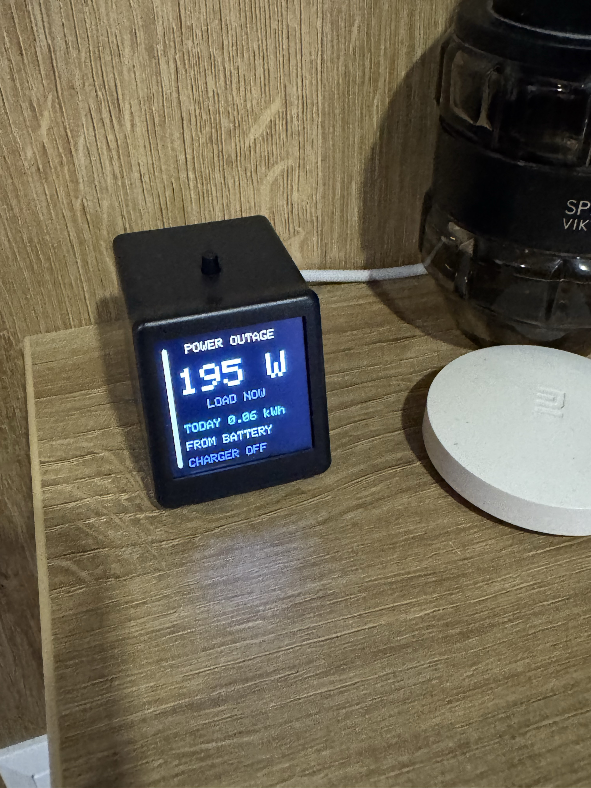 | 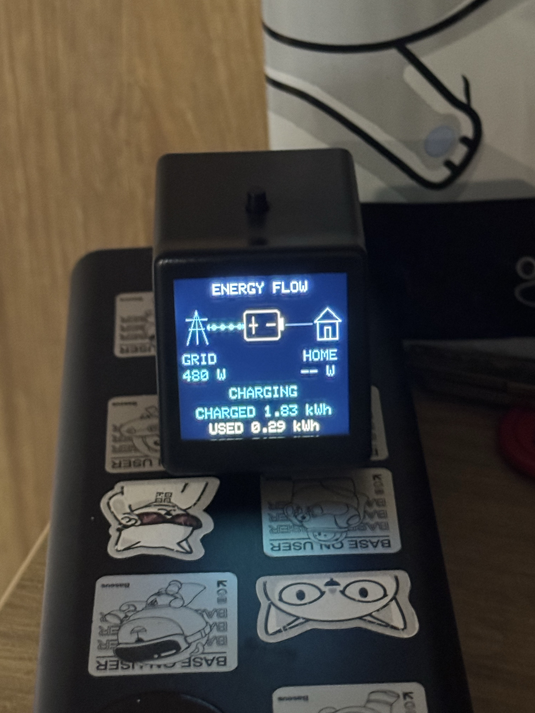 |

### Power-outage response demo

[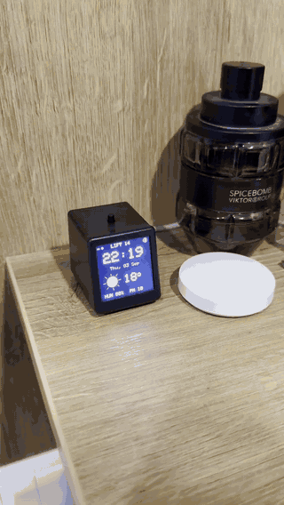](media/video/call14-power-outage-demo.mp4)

When grid power disappears, Call14 leaves the ordinary clock view and surfaces
the information that matters now: current household load, energy used during the
outage, whether the battery is supplying the home, and charger state. It can
then show the complete energy path between grid, battery and household load.
The silent animation is accelerated; click it for the edited real-time MP4.

### Firmware interface gallery

The firmware contains several purpose-built views rather than one overloaded
dashboard. The final gallery will document each of these real screens:

| View | Purpose |
|---|---|
| Home | Time, date, animated weather, temperature, humidity, PM2.5, HA status, and current elevator floor |
| Elevator | Large floor number, direction arrow, and `IDLE`, `CALLING`, `MOVING`, or `ARRIVED` state |
| Energy flow | Visual path between grid, charger/battery, and home load |
| Inverter | Battery charge, household load, estimated runtime, and grid state |
| Charger | Charger state, charging power, accumulated energy, and battery metrics |
| Air raid | Full-screen alarm warning followed by a persistent red indicator |
| All clear | Short full-screen confirmation when an alert ends |
| Motion | Temporary local motion notification from Home Assistant |
| Boot/diagnostic | Startup, network state, and recovery information |

These views are drawn directly with lightweight TFT primitives. Animated
weather icons and partial redraws keep the interface alive without the memory
cost of GIF playback or a heavyweight GUI framework on the ESP8266.

Clean 240×240 design illustrations reconstructed from the firmware will
accompany these real device photographs in the final documentation.

## Part 3: teaching a camera to read the elevator

The elevator controller offered no supported integration API, and the elevator
company was understandably not enthusiastic when a self-taught entrepreneur
asked to connect a homemade gadget to its control board. That refusal led to a
much safer architecture: **observe the indicator, never control the elevator**.

An already authorized cabin camera sees the original red floor indicator. A
local service crops only that small region, determines the floor and illuminated
direction arrow, and publishes the result to Home Assistant over MQTT. No cabin
video or cloud vision service is required for recognition.

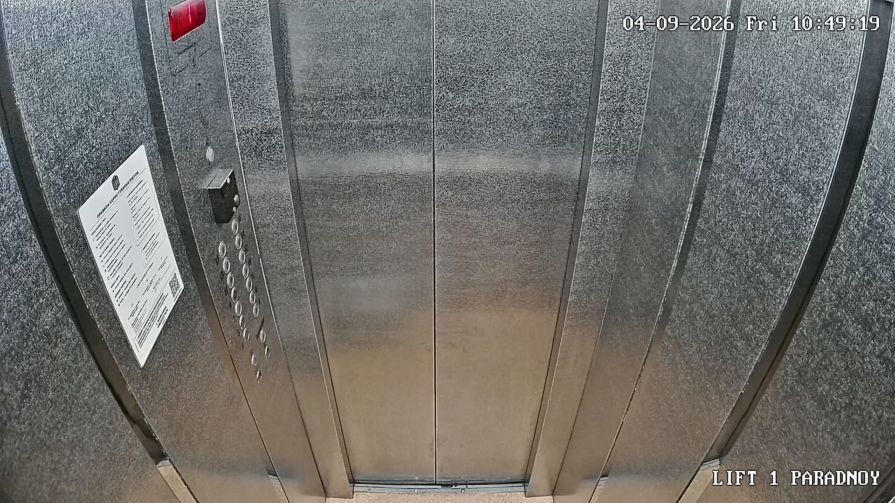

The camera was installed for ordinary building security; Call14 only reuses its
local stream as a read-only sensor. The tiny red indicator in the upper-left
corner of this frame is the complete visual input to the recognizer.

### Why ordinary OCR was not enough

The display looks easy to a human, but it is unusually unfriendly to a camera:

- the glossy red cover reflects passengers, clothing, phones, and even a
  courier's shiny helmet;
- opening the doors replaces dim cabin light with brighter or darker landing
  light, depending on floor, weather, and time of day;
- people entering the cabin change both exposure and reflections;
- the digits and arrows are multiplexed LEDs, so one video frame may capture
  only part of a symbol;
- perspective turns a clean seven-segment digit into a small, slanted shape.

Early OCR and whole-image matching sometimes read `14` as `9`, expanded `1`
into `11`, lost an arrow for a frame, or accepted a reflection as a new floor.
These were not rare laboratory curiosities: they appeared only during real
rides, which is why recording and replaying complete journeys became essential.

This was the point where I was running out of patience — and confidence in the
whole approach. I had rebuilt and tested several recognizers, yet another
passenger or change of light could undo the progress. I was close to abandoning
camera recognition and returning to the elevator company to ask for permission
to connect an ESP module directly to the controller. Besides being difficult to
get approved, that path would also have crossed the clean safety boundary I
wanted the project to keep.

### The idea that unlocked version 5

Then I reconsidered what the camera actually needed to know. It did not need to
understand the complete photograph, the red glass, or anything reflected in it.
The decisive idea was to stop asking, “Which digit does this picture resemble?”
and instead ask, **“Which of the seven physical LED segments are actually on?”**

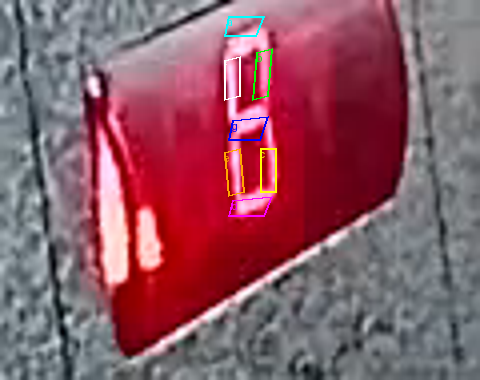

For each segment `a` through `g`, the decoder samples a small mask placed well
inside the expected illuminated stroke. It separately samples the tens digit.
Color channels are combined to emphasize the pale LED light through the red
cover, then normalized against the current frame. The resulting seven-bit code
maps directly to digits `0–9`.

This point-based approach ignores most of the image. A new reflection can cover
half the panel without mattering, provided the small pieces of evidence inside
the real segments remain consistent.

### A hybrid recognizer, not one clever threshold

Segment decoding is the primary reader, but production v5 surrounds it with
several independent safeguards:

1. Three consecutive frames are used without blending neighbouring floor
   digits together. Recognition runs at 4 fps.
2. A segment result is accepted only when its seven-bit pattern is exact, its
   confidence clears the calibrated margin, and the floor is physically
   possible from the last confirmed state.
3. Direction-specific image templates provide a fallback when glare makes the
   segment evidence uncertain. Up, down, and idle images are never casually
   compared with one another because the illuminated arrow changes the panel.
4. A state machine normally permits only the current or next valid floor in the
   direction of travel. The building's real floor sequence is encoded as
   `1, 4, 5, ... 16`, including the physical jump between floors 1 and 4.
5. Arrow detection uses hysteresis. Positive light starts movement immediately;
   a short dark scan phase does not stop it. Several consecutive misses are
   required before the state returns to idle.
6. When a service starts in the middle of a ride or has genuinely lost its
   position, it may re-synchronize only after the segment decoder and an
   unrestricted template decoder independently agree for about three seconds.
7. An unreadable or reflective frame preserves the last confirmed floor instead
   of inventing a more visually tempting answer.

In short, image recognition proposes an observation; temporal consistency and
the elevator's physical behaviour decide whether that observation is believable.

### Testing it like the real world

We recorded and replayed complete rides rather than testing only hand-picked
still images. The main calibration journey covered `14 → 1 → 16 → 14`; another
v5 validation sequence covered `1 → 14 → 1 → 16`. Contact sheets show the
flicker, exposure changes, reflections, and imperfect frames that the algorithm
must survive between the obvious digits.

| Validation ride, part 1 | Validation ride, part 2 |
|---|---|
|  | 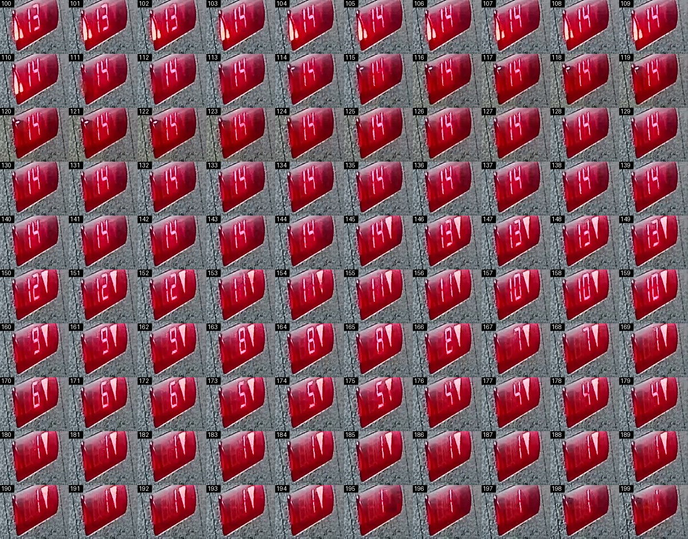 |

| Validation ride, part 3 | Validation ride, part 4 |
|---|---|
| 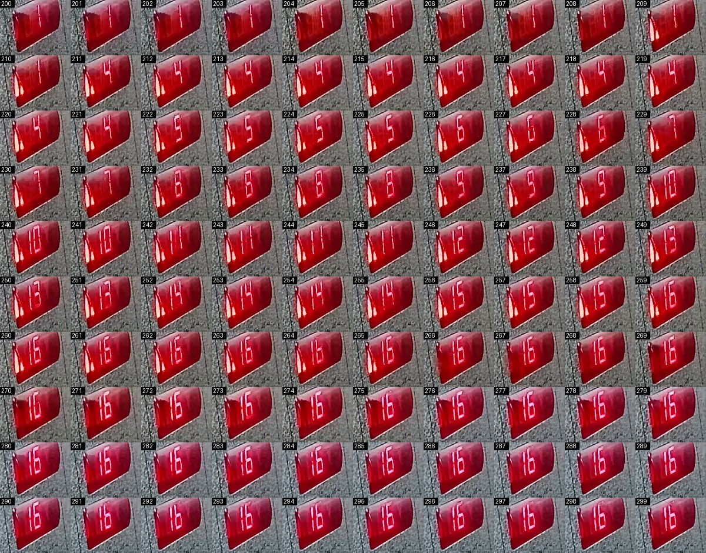 |  |

New versions first ran as shadow services with separate MQTT topics. Only after
their output matched the recorded rides and live ground truth were they promoted
while preserving the existing Home Assistant entity IDs.

The current hybrid v5 has been running continuously since 30 August 2026 with
no service restarts at the time of this repository audit. In every result checked
against the real elevator since this version was deployed, the recognized floor
and direction have been correct: **100% observed accuracy so far**. Day/night
changes, open doors, crowded rides, and strong reflections have not produced a
known error in this version.

This is a report from daily operation on one installation, not a claim of
universal, formally measured 100% accuracy on every elevator and camera. The
repository includes replay material and deterministic code so the result can be
inspected and reproduced instead of taken on faith.

The recognizer source and its calibrated models are in [`recognizer/`](recognizer/).
Installation-specific camera, network, and MQTT credentials are deliberately
excluded.

## Project status

The system is working and used daily. Public, redacted source is now included
for the relay, display and recognizer, together with example Home Assistant
automation, architecture notes and recovery guidance. Final packaging and
installation testing are still in progress before the first tagged release.

## Author

Created by **Yehor Arseniev**, a Kyiv-based entrepreneur and hobbyist
building his first electronics and software project in public.

[LinkedIn](https://ua.linkedin.com/in/yehor-arseniev-91a25080)

## License

The source code and configuration examples are available under the
[MIT License](LICENSE). Original documentation, photographs, diagrams,
screenshots, and videos are available under
[CC BY 4.0](LICENSE-MEDIA.md). Please credit **Yehor Arseniev** and
link back to this repository when reusing the media or story.

## Safety boundary

Call14 does **not** control elevator movement, doors, brakes, or safety systems.
The relay only reproduces a normal press of the existing hall-call button, and
the camera side only observes the existing cabin indicator.

This hobby project is not a life-safety or evacuation system. Building rules,
official emergency guidance, and restrictions on elevator use during fires,
power failures, or other emergencies always take priority.

## Coming next

- One-command recognizer installation helper
- Repeatable offline replay tests and a small privacy-safe sample dataset
- Final wiring diagrams
- Release packaging and checksums

The ready-to-adapt community post is in
[`docs/REDDIT_LAUNCH.md`](docs/REDDIT_LAUNCH.md).

## Building approval and camera access

Our building is managed by an **OSBB**, the Ukrainian legal form of a homeowners' association. I am a co-owner and also serve on its board. The installation and camera-access arrangements were discussed and agreed with the OSBB. The cameras and processing remain local to the building, and access is managed rather than public.

Regulations and approval procedures differ between countries and buildings, so this exact arrangement should not be assumed to apply everywhere. Anyone adapting the project should first obtain the approvals required by their own building management, homeowners' association, elevator service company, and local regulations.
